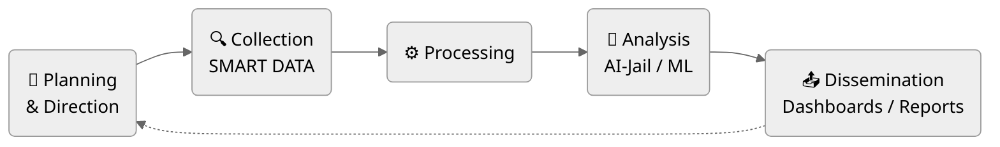

<h1 align="center">
  
</h1>

---

### 👨‍💻 About Me

Python developer focused on building **intelligent**, **automated**, and **scalable** solutions. I bring together **AI**, **AIoT**, and **web automation** to deliver end-to-end platforms – from data collection to machine learning models and autonomous systems.

- 🔭 Currently working on: AI‑driven IoT analytics and smart building platforms  
- 🌱 Deepening knowledge: Artificial Intelligence, embedded systems, and advanced ETL pipelines  
- 💬 Ask me about: Python, web scraping, process automation, Streamlit dashboards, and integrating AI with real-time data  
- ⚡ Techniques: **AI‑Jail** (AI sandboxing & controlled execution environments), **Intelligence Cycle** (OSINT, GEOINT, cyber threat intelligence)  
- 🎯 Passionate about transforming raw data into actionable insights and reducing operational risks through real‑time predictive analytics.

---

### 🛠️ Tech Stack

#### Languages

#### AI / Machine Learning

#### Frameworks & Libraries

#### Databases & ETL

#### Networking & Protocols

#### Tools, Platforms & IoT

---

### 🐍 Contribution Snake

  <picture>
    <source media="(prefers-color-scheme: dark)" srcset="https://raw.githubusercontent.com/luccajuccy/luccajuccy/output/github-contribution-grid-snake-dark.svg">
    <source media="(prefers-color-scheme: light)" srcset="https://raw.githubusercontent.com/luccajuccy/luccajuccy/output/github-contribution-grid-snake.svg">
    
  </picture>

---

### 🚀 Featured Projects

  <!-- ANALYTICA -->
  

    <h3 style="margin: 0 0 8px 0;">
      <a href="https://github.com/luccajuccy/Analytica" style="color: #DDDDDD; text-decoration: none;">✨ ANALYTICA</a>
    </h3>
    
Plataforma web interna para gestão predial (BMS) – dashboards, machine learning, motor de busca, ETL de sensores e democratização dos dados.

    

      
      
      
      
      
    

  

  <!-- NOVAKAR -->
  

    <h3 style="margin: 0 0 8px 0;">
      <a href="https://github.com/luccajuccy/NovaKar" style="color: #CCCCCC; text-decoration: none;">✨ NOVAKAR</a>
    </h3>
    
ERP local para concessionárias – controle de estoque, valores, histórico completo dos veículos, documentações e gestão de vendas.

    

      
      
      
      
    

  

  <!-- AI-JAIL-ORCHESTRA -->
  

    <h3 style="margin: 0 0 8px 0;">
      <a href="https://github.com/luccajuccy/AI-JAIL-Orchestra" style="color: #BBBBBB; text-decoration: none;">✨ AI-JAIL-ORCHESTRA</a>
    </h3>
    
Orquestrador de múltiplos agentes de IA em ambiente isolado – TDD, testes automatizados, pentests e desenvolvimento assistido.

    

      
      
      
    

  

  <!-- BIT-TRACKER -->
  

    <h3 style="margin: 0 0 8px 0;">
      <a href="https://github.com/luccajuccy/BIT-Tracker" style="color: #AAAAAA; text-decoration: none;">✨ BIT-TRACKER</a>
    </h3>
    
Rastreador de carteiras Bitcoin – transações da blockchain salvas em markdown com tags para visualização e análise de relações via Obsidian.

    

      
      
      
    

  

  <!-- JOBS-POR-AI (NOVO) -->
  

    <h3 style="margin: 0 0 8px 0;">
      <a href="https://github.com/luccajuccy/JOBS-POR-AI" style="color: #999999; text-decoration: none;">✨ JOBS-POR-AI</a>
    </h3>
    
Plataforma inteligente de busca e match de vagas de emprego – coleta automatizada, processamento com IA e recomendações personalizadas.

    

      
      
      
      
      
    

  

---

### 📜 Experience & Education Highlights

- **BMS Operations Technician & Python Developer** (Abr 2023 – 2026)  
  Desenvolvi plataforma interna de analytics, automatizei relatórios (redução de 32% no tempo), implementei detecção de falhas com ML (diagnósticos 3x mais rápidos) e integrei sistemas IoT/BMS.

- **Academic Study**  
  - Artificial Intelligence – Gran Faculdade (2026‑2028)  
  - Mechatronics Technician – ETEC Basilides de Godoy (thermal drone project)  
  - Artificial Intelligence, Deep Learning, Python, SQL, HTML/CSS/JS – diversos cursos (mais de 400 horas somadas)

---

### 🧠 Intelligence Cycle

### 💡 Let's Connect!

Estou aberto a colaborar em projetos de **IA, IoT, automação** ou **cibersegurança**.  
Fale comigo pelo e-mail **luccajuccy212@gmail.com** ou conecte-se no [LinkedIn](https://www.linkedin.com/in/lucca-juccy/).

  
  <h1 style="position: relative; top: -120px; color: #00ff41; font-family: 'Courier New', monospace; text-shadow: 0 0 10px #00ff41;">Thank You!</h1>

  
  

